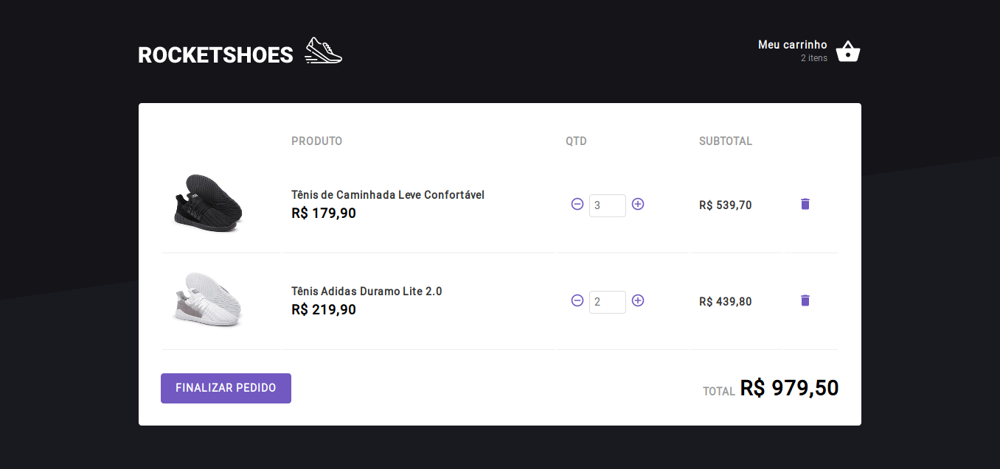
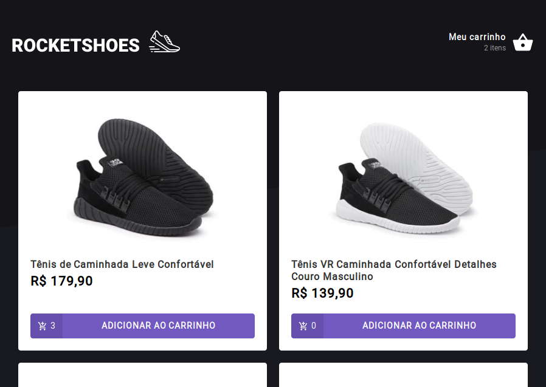
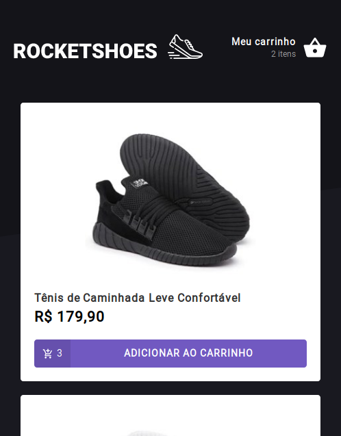

# RocketShoes

**React Web App** using **Redux**, **Styled Components** and **Axios**.

[Live Demo](https://guilhermerodz-rocketshoes.netlify.com/)

This App serves like a **virtual store**. It can handle **API requests** while trying to **add some product** to cart, **e.g checking the available stock before adding an item in the cart**.

**Redux** for handling **global states** and **user actions**.
**Axios** for **sending requests to the fake API**.

Just run `npm start` in your terminal and browse `localhost:3000`.

## Challenge Result

### Responsiveness

